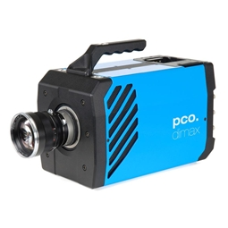

.. _camera-pco:

PCO camera
----------


.. image:: pco-edge.jpg


.. =======================================================================================
.. =======================================================================================

Intoduction
```````````

.. =======================================================================================
.. =======================================================================================

- **PCO camera systems** 

 - PCO develops specialized fast and sensitive video camera systems, mainly for scientific applications; 
   which covers digital camera systems with high dynamic range, high resolution, high speed and low noise. 
   `PCO home page <http://www.pco.de/>`_
 
- **Product overview and technical data of the PCO cameras supported in LIMA**
 
 - **PCO.dimax:** 
   High speed 12 bit CMOS camera with fast image rates of 1469 frames per second (fps) at full resolution of 1920 x 1080 pixel. 
   `(tech data pcodimax) <http://www.pco.de/categories/high-speed-cameras/pcodimax-hd/>`_
 
 - **PCO.edge:**
   Extremely low noise sCMOS camera with fast frame rates (100 fps), wide dynamic range (1:27000), high quantum efficiency, 
   high resolution (2560 x 2160) and large field of view.
   `(tech data pcoedge) <http://www.pco.de/categories/scmos-cameras/pcoedge-42/>`_
 
 - **PCO.2000:**
   High resolution (2048 x 2048 pixel) and low noise 14bit CCD cooled camera system with internal image memory (camRAM), 
   allows fast image recording with 160 MB/s. The available exposure times range from 500 ns to 49 days.
   `(tech data pco2000) <http://www.pco.de/categories/sensitive-cameras/pco2000/>`_
 
 - **PCO.4000:**
   High resolution (4008 x 2672 pixel) and low noise 14bit CCD cooled camera system with internal image memory (camRAM),
   allows fast image recording with 128 MB/s. The available exposure times range from 5 us to 49 days.
   `(tech data) <http://www.pco.de/categories/sensitive-cameras/pco4000/>`_

- **Interface buses**

 - **Cameralink:** used by **PCO.dimax** and **PCO.edge**
 - **GigE:** used by **PCO.2000** and **PCO.4000**
 

- **Type of applications**

 - Mainly used in scientific applications.

- **OS supported**

 - **Win7 Professional** (english) 32 bits SP1.


.. =======================================================================================
.. =======================================================================================

Prerequisites
`````````````

.. =======================================================================================
.. =======================================================================================

- **Required software packages** 

 - **download links**

  - `PCO and Silicon Software download (login/pw required) <ftp://pcoag.biz/>`_

  - `VC++ download <http://www.microsoft.com/visualstudio/en-us/products/2008-editions/express>`_

  - `GSL download <http://sourceforge.net/projects/gnuwin32/files/gsl/1.8/gsl-1.8.exe/download>`_

  - `python download <http://www.python.org/download/releases/2.6.6/>`_

  - `numpy download <http://sourceforge.net/projects/numpy/files/NumPy/1.5.1/>`_

  - `PyQt download <http://www.riverbankcomputing.co.uk/software/pyqt/download>`_

  - `PyTango download <http://www.tango-controls.org/download>`_

  - `GIT download <http://code.google.com/p/msysgit/downloads/list>`_

 
 - **md5 checksum and size of packges used (maybe not updated)**

.. code-block:: sh

 Silicon Software Runtime 5.1.4
     545a30a4aa07260072615257c5c983cd   58881018 DD_DCCLSISORT514WIN32_103.zip
     ca22c0385fc63b92e259d28b11b65021   58930007 RuntimeSetup_v5.1.4_IA32.exe

.. code-block:: sh

 pco-sdk 1.15
     ===> select: silicon softwre section dll meIV
     89619de780943569dcfc885cb0a720d8   11608288 SW_PCOSDKWIN_115.exe
     bb030a743efd0954bb60b05dbfe3c45e   11560659 SW_PCOSDKWIN_115.zip

.. code-block:: sh

 camware 3.08 
    ===> select: silicon softwre section dll meIV
    8bd64a957c57287c4c30c0ce7811343e     12037008 SW_CAMWAREWIN32_308.exe
    ecf7936f451ed3a17cabbff7aa4ec645     11993859 SW_CAMWAREWIN32_308.zip
 
.. code-block:: sh

 VC++ express edition 2008 with SP1 
     62f764849e8fcdf8bfbc342685641304     2728440 vcsetup.exe
 
.. code-block:: sh

 GSL GNU Scientific Lib (required for Process Lib) 
     d0c114f842933622a156bfa757ee14c2     6476814 gsl-1.8.exe
 
.. code-block:: sh

 Python / SIP / modules
     80b1ef074a3b86f34a2e6b454a05c8eb    15227904 python-2.6.6.msi
     267627e760277e5f6a74a83772a4f1d0     2342045 numpy-1.5.1.win32-py2.6-nosse.exe
     97a9c9b88fac273e1dfb4de9d0dce4ea    27712518 PyQt-Py2.6-x86-gpl-4.8.6-1.exe
     dc5200e3199947a9574014537905a4b7     3670016 PyTango-7.1.1.win32-py2.6.msi
 

.. code-block:: sh

 GIT
     a8ab298fb7a728d41f7d787aef7dc8d1    14026948 Git-1.7.7.1-preview20111027.exe
 

- **Enviroment variables** 

 - **system variables** 
 
.. code-block:: sh

 ===> add manually the python path (it is not set by the installation program)
      PATH -> C:\Python26;

 ===> used for some utility batch files
      PATH -> C:\blissadm\bat;

..

 - **user variables** 

.. code-block:: sh

    TANGO_HOST -> <host>:20000


Module configuration
````````````````````
Configuration file **Lima/config.inc**

.. code-block:: sh

 ===> set these values to 1
      COMPILE_CORE=1
      COMPILE_PCO=1

See :ref:`Compilation`


Post installation actions
`````````````````````````
- **enable/disable PCO logs** 

.. code-block:: sh

 ===> rename file extensions (C:\ProgramData\pco): 
      .txt (disabled) / .log (enabled) ----+  
                                   camware.log   <---- created by hand
                                  PCO_CDlg.log
                                  PCO_Conv.log
                                   SC2_Cam.log


- **Command prompt console (Visual Studio)** 

.. code-block:: sh

  > All Programs
    > Microsoft Visual C++ 2008 Express Edition
      > Visual Studio Tools
        > Visual Studio 2008 Command Prompt
        

- **TODO**

- After installing PCO modules :ref:`installation`

- And probably Tango server :ref:`tango_installation`


Configuration
``````````````

- **TODO**


.. _pco-esrf-pc:


PCO EDGE notes
``````````````

.. toctree::
        :maxdepth: 2

        pco_edge
