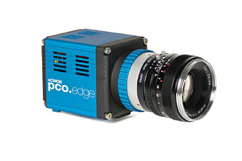

PC characteristics (used for PCO EDGE at ESRF)
``````````````````````````````````````````````

- **PROCESSOR**

.. code-block:: sh

        2x Intel Xeon E5645 Six-Core CPU, 2,40GHz, 80W, Socket LGA1366, 12MB 5,86GT/sec

        CPU's: 2x Xeon SixCore E5645 2,40Ghz 12MB 5,86GT/sec
        Intel Xeon E5645 Six-Core CPU, 2,40GHz, 80W, Socket LGA1366, 12MB
        external cache. 5,86GT/sec QPI speed. 1333MHz memory speed (DDR3 only).
        Intel Technologies: Intel Turbo Boost , Intel Hyper-Threading
        Technology, Intel Virtualization (VT-x), Intel Trusted Execution,
        Enhanced Intel SpeedStep, Intel Demand Based Switching, Execute
        Disable Bit.


- **RAM**

.. code-block:: sh

    24 GB (6x DDR3-1333 Reg. ECC 4 GB module)


- **HD**

.. code-block:: sh

    C:
      WDC WD5003ABYX-01WERA1
      Western Digital 500 GB, 7200 RPM, SATA 2, 300 Mbps

    D:
      Adaptec RAID 5405/5405Q with 2 HD of 450 Gb -> RAID0 837 GB
      HUS156045VLS600
      Hitachi 450GB, 15,000RPM SAS / Serial Attached SCSI, 6Gbps


- **graphic card**

.. code-block:: sh

    Matrox G200eW


- **motherboard**

.. code-block:: sh

        Motherboard Extended ATX format 13,68in x 13in, (34,7cm x 33cm) (W x H);
        2 socket LGA 1366-pin. It supports processors Quad-Core Intel Xeon
        series 5500; QPI bus system (up to 6.4GT/s); *chipset Intel 5520*;

        18 socket DIMM 240 pin, support for up to 288GB memory DDR3
        1333/1066/800MHz Registered or 48GB memory DDR3 unbuffered ECC, the real
        operating ram speed depends on the processor?s model and number of
        installed ram, best performances are achieved through a triple channel
        configuration;


- **PCI slots**

.. code-block:: sh

    1x PCIe x4 (in x8 slot)
    3x PCIe x8
    1x PCIe x8 (in x16 slot)
    2x PCIe x16


PCO EDGE - install instructions for Silicon Software Me4 Board
``````````````````````````````````````````````````````````````

Check the document **camera/pco/doc/Me4_Installation_Test_e1.pdf** with the
requirements and procedure to install the CameraLink grabber card. It is 
important in order to get the maximum transfer speed required by the PCO EDGE
camera.

The boards tested by PCO are:

.. code-block:: sh

 Supermicro X8ST3
 GigaByte GA-X58A-UD3R
 Intel S5520
 Intel DX58SO2
 Supermicro X8DTH-iF

With the PC described in :ref:`pco-esrf-pc` 
the speed of the CameraLink is about
**570 MB/s** (66% of the theoretic max of 860 MB/s). 

